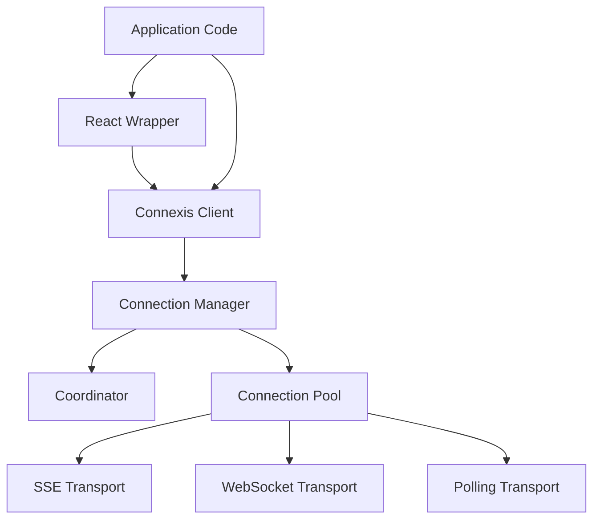
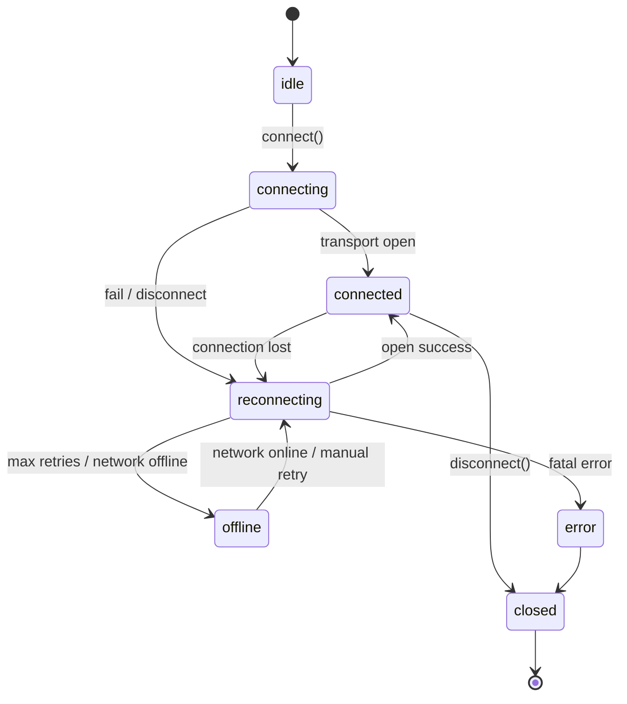

# @connexis Realtime Client

A production-grade, framework-agnostic, universal browser realtime client with intelligent connection management and multi-tab synchronization.

📖 **[Read the Documentation Website](https://HarpalSingh7395.github.io/connexis/)**

**This is NOT just an SSE library. This is NOT a simple WebSocket wrapper.**

`@connexis` acts as a connection manager for browser realtime transports, handling state machines, heartbeats, exponential reconnects, multi-tab leader election, connection sharing, subscription deduplication, and framework hooks.

---

## Key Features

* 🔌 **Transport Agnostic**: Support for WebSockets, SSE (EventSource), and HTTP Polling. Extensible to WebTransport.
* 👥 **Multi-Tab Connection Sharing**: Elects a single leader tab to maintain the socket connection. All other tabs communicate with the leader via `SharedWorker` or `BroadcastChannel`.
* ⚖️ **Flexible Connection Policies**:
  * **Isolated**: Each client has its own dedicated connection.
  * **Shared**: A single shared connection per browser window/tab group.
  * **Hybrid**: Automatically deduplicates subscriptions with matching filters onto a single shared connection while spawning dedicated connections for distinct filters.
  * **Custom**: Provide a custom key selector function.
* ⚙️ **Middleware Pipeline**: Inspect, log, modify, or reject inbound/outbound payloads using Koa-style `next()` middlewares.
* ⚛️ **Framework Hooks**: Sleek React wrapper (`@connexis/react`) providing simple hooks like `useConnection`, `useSubscription` (or `useChannel`), and `usePublish`.
* 📈 **Latency & Throughput Metrics**: Active calculation of latency (via heartbeat ping/pong rounds), uptime, reconnect counts, and inbound/outbound throughput.

---

## Monorepo Packages

```
packages/
  ├── core/               # Lifecycle State Machine, Connection Pool, Middleware, Client API
  ├── coordinator/        # BroadcastChannel & SharedWorker Coordination, Leader Election, Failover
  ├── transport-sse/      # EventSource Server-Sent Events Transport with HTTP POST publish fallback
  ├── transport-websocket/# Native WebSocket Transport
  ├── transport-polling/  # HTTP Polling Transport
  ├── react/              # React Context Provider & Hooks
  └── testing/            # Controllable MockTransport & Benchmark Runner
```

---

## Architecture Diagram



### Connection State Machine



---

## Quick Start Example

```typescript
import { createRealtimeClient } from '@connexis/core';
import { WebSocketTransport } from '@connexis/transport-websocket';
import { Coordinator } from '@connexis/coordinator';

// 1. Initialize the client
const client = createRealtimeClient({
  transport: new WebSocketTransport('wss://api.example.com/realtime'),
  connectionPolicy: 'shared',
  coordinator: new Coordinator('my_app') // Optional: Enables multi-tab connection sharing
});

// 2. Define typed events (TypeScript first)
interface AppEvents {
  orders: { id: string; region: string; total: number };
  notifications: { text: string };
}

const typedClient = client as RealtimeClient<AppEvents>;

// 3. Register Middlewares
typedClient.use(async (context, next) => {
  console.log(`[Middleware] ${context.direction} message on ${context.topic}`, context.payload);
  await next();
});

// 4. Subscribe to topics
const unsubscribe = await typedClient.subscribe('orders', { filter: { region: 'US' } }, (order) => {
  console.log(`New Order in US: $${order.total}`);
});

// 5. Publish events
await typedClient.publish('orders', { id: 'order_123', region: 'US', total: 250 });

// 6. Access Metrics
console.log('Uptime:', typedClient.metrics.uptime);
console.log('Average Latency:', typedClient.metrics.latency, 'ms');
```

---

## Developer Guide & API Reference

### 1. Client Configuration Options

Initialize the `RealtimeClient` using the config options:

```typescript
interface RealtimeClientConfig {
  transport: Transport;               // Transport instance (WebSocket, SSE, Polling)
  connectionPolicy?: ConnectionPolicy; // 'shared' | 'isolated' | 'hybrid' | ((sub: Subscription) => string)
  reconnectOptions?: ReconnectOptions; // Reconnection policy configuration
  heartbeatOptions?: HeartbeatOptions; // Pin/pong configurations
  coordinator?: ICoordinator;          // Coordinator instance for multi-tab sync
  debug?: boolean;                     // Enbles diagnostic logs to console
}
```

#### Reconnection Options (`ReconnectOptions`)
```typescript
interface ReconnectOptions {
  maxAttempts?: number;           // Max reconnection attempts (default is Infinity)
  delay?: number | ((attempt: number) => number); // Fixed or exponential delay function
  timeout?: number;               // Timeout in ms for connection handshakes
  stableThreshold?: number;       // Stabilization duration in ms (default is 5000ms)
}
```

#### Heartbeat Options (`HeartbeatOptions`)
```typescript
interface HeartbeatOptions {
  enabled?: boolean;              // Enable heartbeat ping/pongs (default is true)
  interval?: number;              // Heartbeat frequency in ms (default is 30000ms)
  timeout?: number;               // Heartbeat timeout before assuming dead connection (default is 10000ms)
  message?: any;                  // Custom ping payload
}
```

---

### 2. Authentication & Token Rotation

`@connexis` handles authentication dynamically for all transport layers. Instead of providing a static token, supply an async callback function returning a `Promise<string>`. This callback is re-evaluated before every new connection or reconnect retry, preventing handshake failures due to expired credentials.

```typescript
const transport = new WebSocketTransport('wss://api.example.com/events', {
  authToken: async () => {
    const freshToken = await retrieveNewSessionToken();
    return freshToken;
  }
});
```

---

### 3. Connection Policies

Govern how physical connections are reused and shared across matching subscriptions and multiple browser tabs:

1. **`isolated`**: Every client/subscription spawns its own physical connection.
2. **`shared`**: Exactly one connection is maintained browser-wide (led by the leader tab). All other tabs delegate subscriptions to the leader.
3. **`hybrid`**: Deduplicates identical subscriptions (same topic and filter) onto a shared connection. Subscriptions with unique filters automatically trigger new dedicated connections.
4. **Custom**: Provide a custom resolver function `(subscription: Subscription) => string` to group connections based on subscription properties.

```typescript
const client = createRealtimeClient({
  transport: new WebSocketTransport('wss://api.example.com/events'),
  connectionPolicy: (sub) => {
    // Group connections by subscription metadata region
    return `conn_${sub.metadata?.region || 'global'}`;
  }
});
```

---

### 4. Middleware Pipeline

Async, Koa-style middlewares can be registered to intercept, inspect, modify, or drop messages.

```typescript
client.use(async (context, next) => {
  console.log(`Direction: ${context.direction}`); // 'inbound' or 'outbound'
  console.log(`Topic: ${context.topic}`);
  
  if (context.direction === 'inbound') {
    // Reject messages that do not meet criteria
    if (!context.payload.verified) {
      throw new Error('Unverified message payload');
    }
  }

  await next(); // Hand over control to the next middleware
});
```

---

### 5. React Hooks Wrapper

Use `@connexis/react` to cleanly hook connection state and message handling into your components.

```tsx
import React from 'react';
import { RealtimeProvider, useConnection, useSubscription, usePublish } from '@connexis/react';
import { client } from './client';

export function Dashboard() {
  const { state, metrics } = useConnection();
  const publish = usePublish();

  // Automatically subscribes on mount, unsubscribes on unmount.
  // Resilient to React Strict Mode double-effect execution.
  useSubscription('orders', { filter: { region: 'US' } }, (order) => {
    console.log('Received order:', order);
  });

  return (
    <div>
      <div>Status: {state}</div>
      <div>Latency: {metrics.latency.toFixed(1)} ms</div>
      <button onClick={() => publish('notifications', { text: 'Hello World' })}>
        Send Alert
      </button>
    </div>
  );
}

export function App() {
  return (
    <RealtimeProvider client={client}>
      <Dashboard />
    </RealtimeProvider>
  );
}
```

---

## Performance & Stress Testing

We include a comprehensive mock-driven benchmark and stress suite under `packages/testing`:

* **Subscription Throttling**: Verifies reference counting and connection recycling.
* **Hybrid Deduplication**: Asserts that 1,000 subscriptions split over 3 unique filter values generate exactly 3 connection handles.
* **Online/Offline Chaos Simulation**: Simulates severe network volatility (online/offline transitions) to ensure eventual consistency.
* **Throughput Benchmarks**: Tracks overhead of Koa-style middlewares.

To run the benchmarks:
```bash
pnpm run test
```

*Typical benchmark numbers on a local development machine:*
```
┌─────────┬───────────────────────────┬───────┬────────────┬──────────────┐
│ (index) │ operation                 │ count │ durationMs │ opsPerSecond │
├─────────┼───────────────────────────┼───────┼────────────┼──────────────┤
│ 0       │ 'subscribe + unsubscribe' │ 10000 │ 1242.3     │ 16098.0      │
│ 1       │ 'publish message'         │ 50000 │ 133.6      │ 374174.6     │
└─────────┴───────────────────────────┴───────┴────────────┴──────────────┘
```

---

## License

MIT - See the [LICENSE](LICENSE) file for details.
